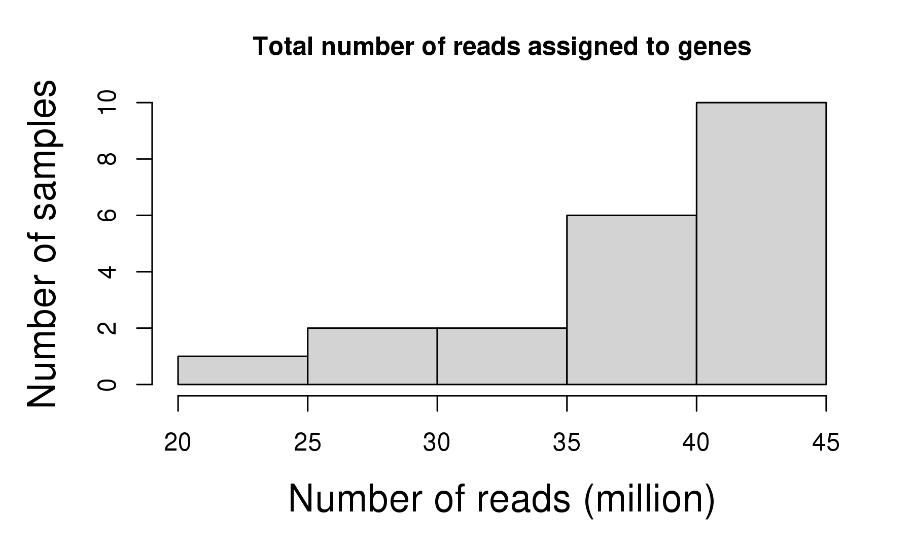
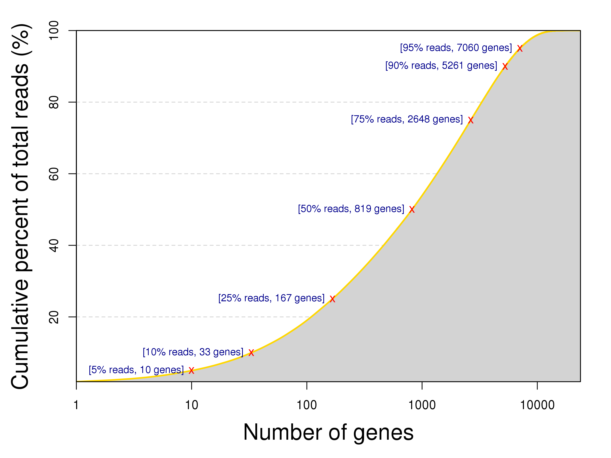
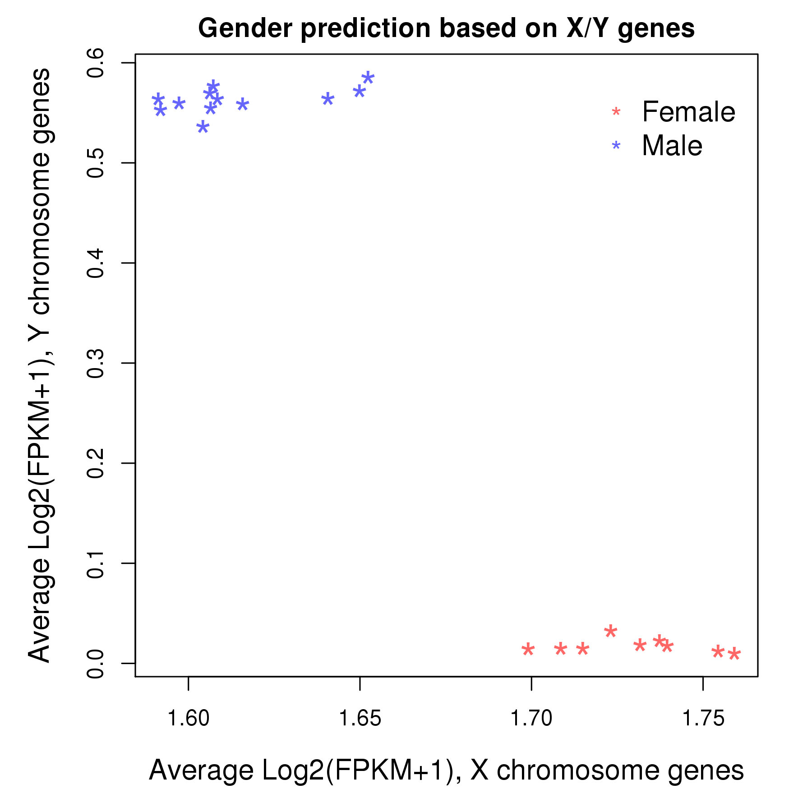
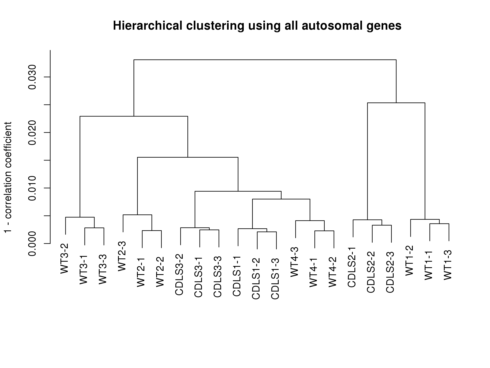
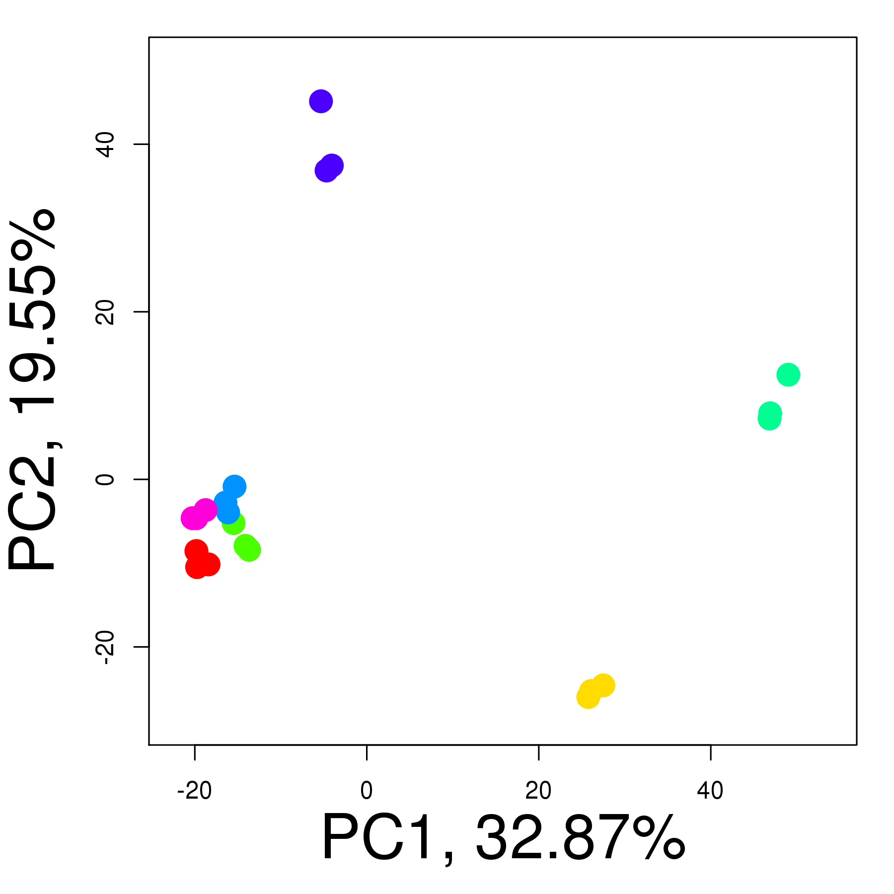

**_[Go back to project home](http://mybic.chop.edu/labs/Krantz_lab/iPSC_CdLS)_**

## Summary

- Number of samples: 21
- Number of genes: 23,684
- Total number of reads assigned to genes, per sample: 37.74 (million)
- Type of reads to be assigned to genes: _as is_

 

**Figure 1:** Distribution of total read count per sample. The total read counts were calculated by summing the read count of all genes. Highly inconsistent read counts between samples might suggest data quality issues and affect downstream analysis. For example, extremely low read count could be caused by insufficient RNA material due to degradation or high sequencing error rate. _Shapiro-Wilk_ normality test shows that the total read counts of this data set is not normally distributed (p = 0.003634).
  
- The mean and median of total read count are respectively **37.74** and **39.32** millions. 
- The first and third quantiles are respectively **36.5** and **40.74** millions.. 
- The minimum and maximum are respectively: **20.68** (sample _CDLS2-1_) and **44.39** (sample _CDLS1-3_) millions..

 

**Figure 2:** Unbalanced read counts across genes. Due to difference in RNA abundance and gene length, most of the squencing reads were contributed by a small portion of all genes. For example, more than 90% of the reads in this data set were contributed by 22.21% of the genes. Additionally, 

- 2412 genes have 0 read mapped to them,
- 5426 genes have less 1 read per sample mapped to them,
- 7429 genes have less 5 reads per sample mapped to them

**_[Go back to project home](http://mybic.chop.edu/labs/Krantz_lab/iPSC_CdLS)_**

## Sample classification

For all analyses in this section, between-sample normalization was first done by converting read counts of genes to FPKM (fragments per kilobase per million reads). 

### Gender prediction

 

### Hierarchical clustering

 

### Principal components analysis

 

**Figure 4:** PCA plot. 
  
Same PCA plot color-coded by different sample attributes:   
- [Subject](PCA_Subject.pdf),   
- [Clone](PCA_Clone.pdf),   
- [Gender](PCA_Gender.pdf),   
- [CdLS](PCA_CdLS.pdf)

**_[Go back to project home](http://mybic.chop.edu/labs/Krantz_lab/iPSC_CdLS)_**

## Per sample statistics

Click [here](sample_summary.html) to veiw full table.

---
**_END OF DOCUMENT_**

