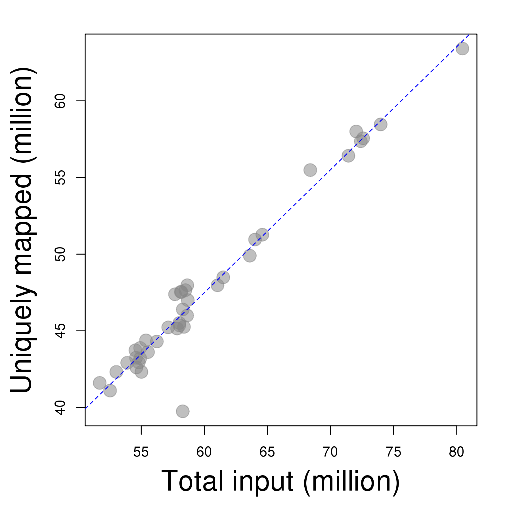
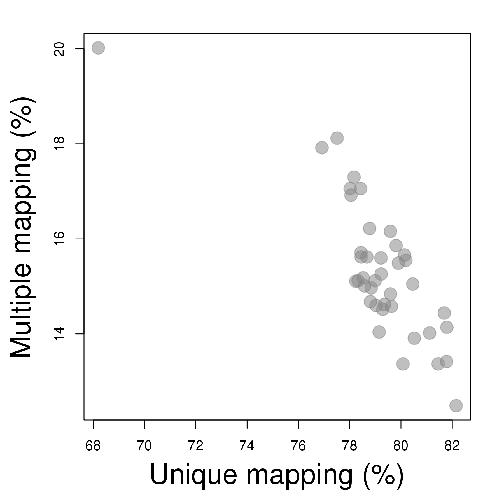
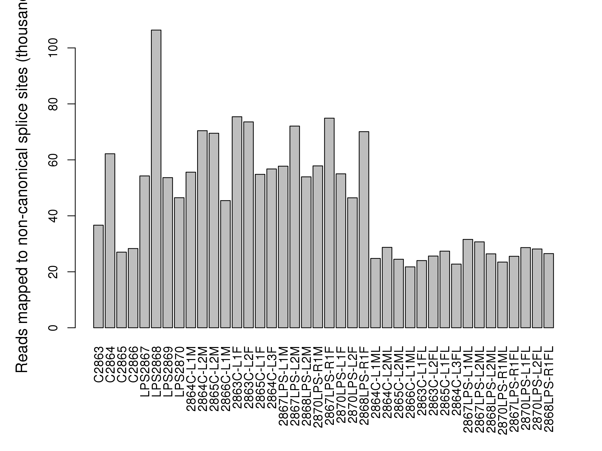
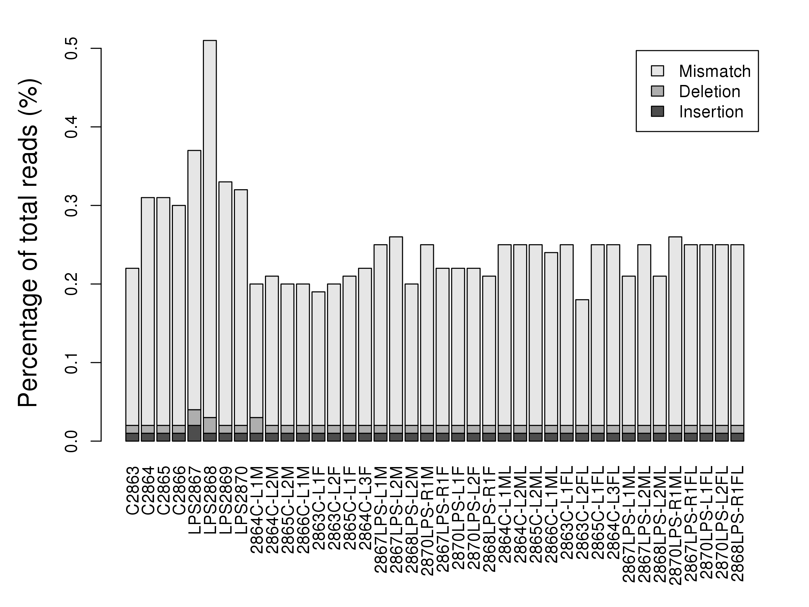
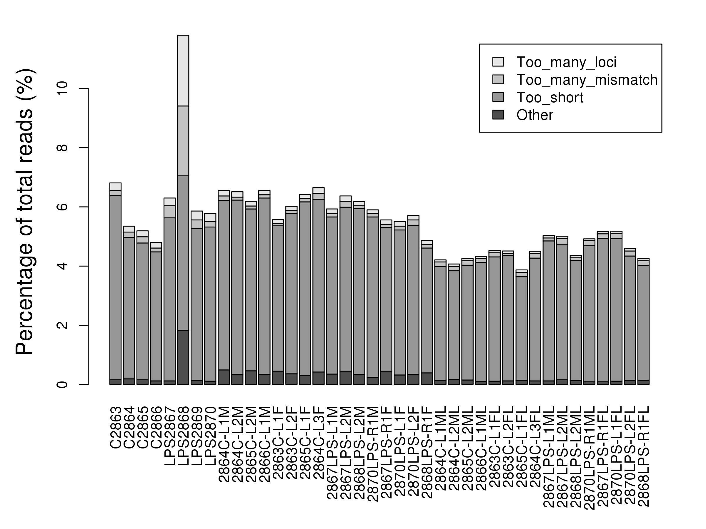

# Introduction

This report is a summary of STAR runs on a RNA-seq data set. It uses information provided by the *_Log.final.out file generated from each STAR run. 

  - **Output directory**: /home/zhangz/R/source/Rnaseq/examples/SummarizeStar/output
  - **STAR program**: /mnt/isilon/cbmi/variome/rnaseq_workspace/tools/STAR-2.5.1b/bin/Linux_x86_64_static/STAR
  - **Samtools program**: /mnt/isilon/cbmi/variome/bin/Samtools/samtools-1.2/samtools
  - **Passes**: 2
  - **qsub**: TRUE

STAR Parameters:

  - runThreadN = 8
  - readFilesCommand = zcat
  - genomeDir = /mnt/isilon/cbmi/variome/rnaseq_workspace/refs/mm38/star
  - sjdbGTFfile = /mnt/isilon/cbmi/variome/rnaseq_workspace/refs/mm38/GCF_000001635.24_GRCm38.p4_genomic.gff
  - outSAMtype = SAM
  - chimSegmentMin = 32
  - outFilterType = BySJout
  - outFilterMultimapNmax = 20
  - alignSJoverhangMin = 8
  - alignSJDBoverhangMin = 1
  - outFilterMismatchNmax = 999
  - outFilterMismatchNoverLmax = 0.04
  - alignIntronMin = 20
  - alignIntronMax = 1000000
  - alignMatesGapMax = 1000000

# Summary statistics

|                                      |  Min.| 1st Qu.| Median|     Mean| 3rd Qu.|  Max.|
|:-------------------------------------|-----:|-------:|------:|--------:|-------:|-----:|
|Total input, million reads            | 51.71|  55.000|  58.16| 60.06000| 62.0200| 80.45|
|Alignment rate (%), unique mapping    | 68.20|  78.450|  79.18| 79.13000| 80.1000| 82.15|
|Alignment rate (%), unique + multiple | 88.22|  93.810|  94.56| 94.47000| 95.4100| 96.13|
|Mismatch rate (%)                     |  0.16|   0.190|   0.23|  0.22850|  0.2300|  0.48|
|Deletion rate (%)                     |  0.01|   0.010|   0.01|  0.01075|  0.0100|  0.02|
|Insertion rate (%)                    |  0.01|   0.010|   0.01|  0.01025|  0.0100|  0.02|
|Too many loci (%)                     |  0.06|   0.080|   0.14|  0.19400|  0.1800|  2.39|
|Too many mismatch (%)                 |  0.07|   0.110|   0.15|  0.20700|  0.1725|  2.36|
|Too short (%)                         |  3.50|   4.215|   4.86|  4.85700|  5.4320|  6.22|

# Figures

## Alignment rate

Total input vs. uniquely aligned, read count

 

## Unique vs. multiple mapping

Unique vs. multiple mapping, percentage

 

## Non-canonical splice sites

Number of non-canonical splice sites identified from each library

 

## Mismatches and INDELs

Percentage of mismatches and INDELs

 

## Outliers

Outlier reads: mapped to too many loci, too many mismatches, too short, and others

 

# Tables

## Run information

|             |  Mapping_star   |   Mapping_end   | Speed | Read_length | Number_reads |
|:------------|:---------------:|:---------------:|:-----:|:-----------:|:------------:|
|C2863        | Mar 02 22:41:56 | Mar 02 23:37:16 | 61.96 |     200     |  57,140,539  |
|C2864        | Mar 02 22:37:35 | Mar 02 23:18:57 | 83.66 |     200     |  57,678,077  |
|C2865        | Mar 02 22:39:31 | Mar 02 23:30:15 | 69.19 |     200     |  58,503,755  |
|C2866        | Mar 02 22:39:37 | Mar 02 23:25:53 | 75.39 |     200     |  58,135,820  |
|LPS2867      | Mar 02 22:35:07 | Mar 02 23:18:04 | 77.59 |     200     |  55,539,026  |
|LPS2868      | Mar 02 22:38:00 | Mar 03 06:48:07 | 7.14  |     200     |  58,289,326  |
|LPS2869      | Mar 02 22:38:50 | Mar 02 23:34:38 | 63.05 |     200     |  58,639,284  |
|LPS2870      | Mar 02 22:42:57 | Mar 02 23:27:47 | 72.12 |     200     |  53,890,556  |
|2864C-L1M    | Mar 02 22:34:13 | Mar 02 23:25:08 | 69.16 |     200     |  58,689,360  |
|2864C-L2M    | Mar 02 22:45:31 | Mar 02 23:48:44 | 76.36 |     200     |  80,451,779  |
|2865C-L2M    | Mar 02 22:48:57 | Mar 02 23:44:53 | 77.86 |     200     |  72,586,064  |
|2866C-L1M    | Mar 02 22:41:30 | Mar 02 23:21:04 | 83.11 |     200     |  54,809,117  |
|2863C-L1F    | Mar 02 22:37:58 | Mar 02 23:29:08 | 84.47 |     200     |  72,036,332  |
|2863C-L2F    | Mar 02 22:42:07 | Mar 02 23:38:33 | 68.68 |     200     |  64,598,433  |
|2865C-L1F    | Mar 02 22:39:54 | Mar 02 23:31:42 | 70.71 |     200     |  61,046,927  |
|2864C-L3F    | Mar 02 22:39:11 | Mar 02 23:30:08 | 61.86 |     200     |  52,533,673  |
|2867LPS-L1M  | Mar 02 22:35:00 | Mar 02 23:23:09 | 79.26 |     200     |  63,604,176  |
|2867LPS-L2M  | Mar 02 22:38:07 | Mar 02 23:48:53 | 62.72 |     200     |  73,973,748  |
|2868LPS-L2M  | Mar 02 22:37:08 | Mar 02 23:32:21 | 66.83 |     200     |  61,501,992  |
|2870LPS-R1M  | Mar 02 22:37:12 | Mar 02 23:29:01 | 82.70 |     200     |  71,419,664  |
|2867LPS-R1F  | Mar 02 22:38:05 | Mar 02 23:27:38 | 77.52 |     200     |  64,021,829  |
|2870LPS-L1F  | Mar 02 22:44:27 | Mar 02 23:46:53 | 69.58 |     200     |  72,399,179  |
|2870LPS-L2F  | Mar 02 22:42:38 | Mar 02 23:28:44 | 71.48 |     200     |  54,921,042  |
|2868LPS-R1F  | Mar 02 22:37:28 | Mar 02 23:22:14 | 91.67 |     200     |  68,396,671  |
|2864C-L1ML   | Mar 02 22:50:13 | Mar 02 23:33:09 | 77.39 |     200     |  55,378,147  |
|2864C-L2ML   | Mar 02 22:35:15 | Mar 02 23:22:40 | 74.22 |     200     |  58,653,865  |
|2865C-L2ML   | Mar 02 22:43:08 | Mar 02 23:21:02 | 86.34 |     200     |  54,537,485  |
|2866C-L1ML   | Mar 02 22:39:19 | Mar 02 23:19:38 | 78.92 |     200     |  53,027,128  |
|2863C-L1FL   | Mar 02 22:41:36 | Mar 02 23:26:29 | 77.56 |     200     |  58,022,655  |
|2863C-L2FL   | Mar 02 22:39:06 | Mar 02 23:19:47 | 85.57 |     200     |  58,024,246  |
|2865C-L1FL   | Mar 02 22:38:24 | Mar 02 23:17:47 | 88.65 |     200     |  58,187,304  |
|2864C-L3FL   | Mar 02 22:37:42 | Mar 02 23:14:32 | 84.23 |     200     |  51,709,700  |
|2867LPS-L1ML | Mar 02 23:00:57 | Mar 02 23:43:49 | 80.97 |     200     |  57,847,860  |
|2867LPS-L2ML | Mar 02 22:42:27 | Mar 02 23:22:01 | 85.28 |     200     |  56,239,877  |
|2868LPS-L2ML | Mar 02 22:46:53 | Mar 02 23:33:36 | 74.99 |     200     |  58,388,067  |
|2870LPS-R1ML | Mar 02 22:45:28 | Mar 02 23:29:30 | 74.43 |     200     |  54,620,369  |
|2867LPS-R1FL | Mar 02 22:38:29 | Mar 02 23:22:19 | 75.31 |     200     |  55,019,421  |
|2870LPS-L1FL | Mar 02 22:40:10 | Mar 02 23:19:37 | 83.02 |     200     |  54,587,346  |
|2870LPS-L2FL | Mar 02 22:40:11 | Mar 02 23:16:30 | 90.74 |     200     |  54,919,965  |
|2868LPS-R1FL | Mar 02 22:48:19 | Mar 02 23:31:39 | 80.72 |     200     |  58,294,557  |

* Speed: mapping speed, million of reads per hour

## Mapping results

### Mapped reads, count

|             |   Input    |   Unique   |   Splice   |  Multiple  | Chimeric  |
|:------------|:----------:|:----------:|:----------:|:----------:|:---------:|
|C2863        | 57,140,539 | 45,224,859 | 26,333,237 | 8,024,212  | 1,475,089 |
|C2864        | 57,678,077 | 47,383,434 | 25,898,212 | 7,206,858  | 1,256,945 |
|C2865        | 58,503,755 | 47,651,274 | 27,994,992 | 7,820,951  | 1,242,161 |
|C2866        | 58,135,820 | 47,541,874 | 28,218,827 | 7,804,069  | 1,230,573 |
|LPS2867      | 55,539,026 | 43,613,088 | 24,174,654 | 8,430,152  | 1,167,810 |
|LPS2868      | 58,289,326 | 39,750,752 | 20,454,935 | 11,667,973 | 1,088,004 |
|LPS2869      | 58,639,284 | 45,995,298 | 26,013,427 | 9,211,372  | 1,252,805 |
|LPS2870      | 53,890,556 | 42,915,321 | 24,929,460 | 7,858,178  | 1,337,109 |
|2864C-L1M    | 58,689,360 | 47,001,317 | 26,624,387 | 7,846,028  | 1,272,954 |
|2864C-L2M    | 80,451,779 | 63,405,469 | 42,143,077 | 11,812,014 | 1,667,531 |
|2865C-L2M    | 72,586,064 | 57,553,609 | 34,476,997 | 10,537,528 | 1,435,442 |
|2866C-L1M    | 54,809,117 | 42,934,584 | 24,748,780 | 8,284,712  | 1,332,597 |
|2863C-L1F    | 72,036,332 | 58,001,207 | 33,989,766 | 10,017,133 | 1,196,370 |
|2863C-L2F    | 64,598,433 | 51,268,448 | 30,829,437 | 9,443,038  | 1,296,505 |
|2865C-L1F    | 61,046,927 | 47,967,935 | 29,086,955 | 9,163,766  | 1,220,950 |
|2864C-L3F    | 52,533,673 | 41,102,200 | 25,438,748 | 7,940,453  |  984,329  |
|2867LPS-L1M  | 63,604,176 | 49,899,708 | 30,505,878 | 9,933,706  | 1,172,921 |
|2867LPS-L2M  | 73,973,748 | 58,458,707 | 33,813,429 | 10,802,547 | 1,201,700 |
|2868LPS-L2M  | 61,501,992 | 48,488,801 | 30,440,441 | 9,205,426  | 1,120,997 |
|2870LPS-R1M  | 71,419,664 | 56,415,555 | 34,407,365 | 10,795,087 | 1,217,153 |
|2867LPS-R1F  | 64,021,829 | 50,953,706 | 31,429,140 | 9,503,196  | 1,145,599 |
|2870LPS-L1F  | 72,399,179 | 57,362,319 | 33,803,580 | 11,048,257 | 1,406,930 |
|2870LPS-L2F  | 54,921,042 | 43,207,998 | 25,008,930 | 8,579,499  | 1,078,581 |
|2868LPS-R1F  | 68,396,671 | 55,481,671 | 32,971,296 | 9,589,405  | 1,117,870 |
|2864C-L1ML   | 55,378,147 | 44,377,346 | 27,240,083 | 8,670,199  |  618,787  |
|2864C-L2ML   | 58,653,865 | 47,972,002 | 26,608,206 | 8,293,513  |  722,236  |
|2865C-L2ML   | 54,537,485 | 43,733,356 | 26,619,177 | 8,480,904  |  727,812  |
|2866C-L1ML   | 53,027,128 | 42,320,800 | 25,685,569 | 8,412,377  |  685,823  |
|2863C-L1FL   | 58,022,655 | 45,357,738 | 27,277,980 | 10,040,391 |  718,124  |
|2863C-L2FL   | 58,024,246 | 45,510,473 | 26,615,352 | 9,898,771  |  902,847  |
|2865C-L1FL   | 58,187,304 | 47,532,703 | 27,206,258 | 8,402,650  |  736,612  |
|2864C-L3FL   | 51,709,700 | 41,603,095 | 26,594,377 | 7,782,242  |  637,614  |
|2867LPS-L1ML | 57,847,860 | 45,148,732 | 26,624,813 | 9,790,283  |  875,730  |
|2867LPS-L2ML | 56,239,877 | 44,303,899 | 22,323,854 | 9,119,871  |  748,474  |
|2868LPS-L2ML | 58,388,067 | 45,258,906 | 26,402,812 | 10,581,691 |  766,297  |
|2870LPS-R1ML | 54,620,369 | 42,614,662 | 27,083,959 | 9,320,797  |  719,779  |
|2867LPS-R1FL | 55,019,421 | 42,322,141 | 25,179,090 | 9,858,585  |  830,127  |
|2870LPS-L1FL | 54,587,346 | 43,244,708 | 25,303,265 | 8,514,727  |  955,917  |
|2870LPS-L2FL | 54,919,965 | 43,882,184 | 25,016,165 | 8,508,797  |  912,717  |
|2868LPS-R1FL | 58,294,557 | 46,395,146 | 27,426,807 | 9,418,469  |  679,156  |

* Unique: reads mapped to one and only one genomic loci
* Splice: reads mapped to splice junctions
* Multiple: reads mapped to multiple genomic loci

### Mapped reads, percentage

|             | Input | Unique | Splice | Multiple | Chimeric |
|:------------|:-----:|:------:|:------:|:--------:|:--------:|
|C2863        |  100  | 79.15  | 46.09  |  14.04   |   2.58   |
|C2864        |  100  | 82.15  | 44.90  |  12.49   |   2.18   |
|C2865        |  100  | 81.45  | 47.85  |  13.37   |   2.12   |
|C2866        |  100  | 81.78  | 48.54  |  13.42   |   2.12   |
|LPS2867      |  100  | 78.53  | 43.53  |  15.18   |   2.10   |
|LPS2868      |  100  | 68.20  | 35.09  |  20.02   |   1.87   |
|LPS2869      |  100  | 78.44  | 44.36  |  15.71   |   2.14   |
|LPS2870      |  100  | 79.63  | 46.26  |  14.58   |   2.48   |
|2864C-L1M    |  100  | 80.08  | 45.36  |  13.37   |   2.17   |
|2864C-L2M    |  100  | 78.81  | 52.38  |  14.68   |   2.07   |
|2865C-L2M    |  100  | 79.29  | 47.50  |  14.52   |   1.98   |
|2866C-L1M    |  100  | 78.33  | 45.15  |  15.12   |   2.43   |
|2863C-L1F    |  100  | 80.52  | 47.18  |  13.91   |   1.66   |
|2863C-L2F    |  100  | 79.36  | 47.72  |  14.62   |   2.01   |
|2865C-L1F    |  100  | 78.58  | 47.65  |  15.01   |   2.00   |
|2864C-L3F    |  100  | 78.24  | 48.42  |  15.11   |   1.87   |
|2867LPS-L1M  |  100  | 78.45  | 47.96  |  15.62   |   1.84   |
|2867LPS-L2M  |  100  | 79.03  | 45.71  |  14.60   |   1.62   |
|2868LPS-L2M  |  100  | 78.84  | 49.50  |  14.97   |   1.82   |
|2870LPS-R1M  |  100  | 78.99  | 48.18  |  15.12   |   1.70   |
|2867LPS-R1F  |  100  | 79.59  | 49.09  |  14.84   |   1.79   |
|2870LPS-L1F  |  100  | 79.23  | 46.69  |  15.26   |   1.94   |
|2870LPS-L2F  |  100  | 78.67  | 45.54  |  15.62   |   1.96   |
|2868LPS-R1F  |  100  | 81.12  | 48.21  |  14.02   |   1.63   |
|2864C-L1ML   |  100  | 80.14  | 49.19  |  15.66   |   1.12   |
|2864C-L2ML   |  100  | 81.79  | 45.36  |  14.14   |   1.23   |
|2865C-L2ML   |  100  | 80.19  | 48.81  |  15.55   |   1.33   |
|2866C-L1ML   |  100  | 79.81  | 48.44  |  15.86   |   1.29   |
|2863C-L1FL   |  100  | 78.17  | 47.01  |  17.30   |   1.24   |
|2863C-L2FL   |  100  | 78.43  | 45.87  |  17.06   |   1.56   |
|2865C-L1FL   |  100  | 81.69  | 46.76  |  14.44   |   1.27   |
|2864C-L3FL   |  100  | 80.46  | 51.43  |  15.05   |   1.23   |
|2867LPS-L1ML |  100  | 78.05  | 46.03  |  16.92   |   1.51   |
|2867LPS-L2ML |  100  | 78.78  | 39.69  |  16.22   |   1.33   |
|2868LPS-L2ML |  100  | 77.51  | 45.22  |  18.12   |   1.31   |
|2870LPS-R1ML |  100  | 78.02  | 49.59  |  17.06   |   1.32   |
|2867LPS-R1FL |  100  | 76.92  | 45.76  |  17.92   |   1.51   |
|2870LPS-L1FL |  100  | 79.22  | 46.35  |  15.60   |   1.75   |
|2870LPS-L2FL |  100  | 79.90  | 45.55  |  15.49   |   1.66   |
|2868LPS-R1FL |  100  | 79.59  | 47.05  |  16.16   |   1.17   |

### Splice sites, count

|             |   Total    | Annotated  |   GT/AG    |  GC/AG  | AT/AC  | Non-canonical |
|:------------|:----------:|:----------:|:----------:|:-------:|:------:|:-------------:|
|C2863        | 26,333,237 | 26,284,251 | 25,963,802 | 314,477 | 18,300 |    36,658     |
|C2864        | 25,898,212 | 25,843,982 | 25,560,618 | 256,138 | 19,278 |    62,178     |
|C2865        | 27,994,992 | 27,942,859 | 27,621,298 | 327,762 | 18,908 |    27,024     |
|C2866        | 28,218,827 | 28,166,516 | 27,833,989 | 337,013 | 19,509 |    28,316     |
|LPS2867      | 24,174,654 | 24,118,600 | 23,813,489 | 290,766 | 16,138 |    54,261     |
|LPS2868      | 20,454,935 | 20,380,706 | 20,126,751 | 209,396 | 12,409 |    106,379    |
|LPS2869      | 26,013,427 | 25,952,955 | 25,621,642 | 321,513 | 16,618 |    53,654     |
|LPS2870      | 24,929,460 | 24,882,986 | 24,593,425 | 271,929 | 17,634 |    46,472     |
|2864C-L1M    | 26,624,387 | 26,554,452 | 26,355,231 | 193,107 | 20,454 |    55,595     |
|2864C-L2M    | 42,143,077 | 42,056,254 | 41,746,958 | 298,516 | 27,182 |    70,421     |
|2865C-L2M    | 34,476,997 | 34,385,277 | 34,121,961 | 258,877 | 26,654 |    69,505     |
|2866C-L1M    | 24,748,780 | 24,678,243 | 24,488,648 | 194,770 | 19,920 |    45,442     |
|2863C-L1F    | 33,989,766 | 33,902,132 | 33,634,335 | 254,083 | 25,939 |    75,409     |
|2863C-L2F    | 30,829,437 | 30,750,920 | 30,506,117 | 226,853 | 22,905 |    73,562     |
|2865C-L1F    | 29,086,955 | 29,011,712 | 28,791,467 | 219,071 | 21,595 |    54,822     |
|2864C-L3F    | 25,438,748 | 25,374,273 | 25,178,118 | 184,901 | 18,981 |    56,748     |
|2867LPS-L1M  | 30,505,878 | 30,417,290 | 30,194,988 | 229,892 | 23,256 |    57,742     |
|2867LPS-L2M  | 33,813,429 | 33,718,608 | 33,462,679 | 253,626 | 25,054 |    72,070     |
|2868LPS-L2M  | 30,440,441 | 30,365,104 | 30,121,927 | 241,602 | 22,982 |    53,930     |
|2870LPS-R1M  | 34,407,365 | 34,312,071 | 34,029,626 | 291,474 | 28,419 |    57,846     |
|2867LPS-R1F  | 31,429,140 | 31,345,312 | 31,102,441 | 228,886 | 22,915 |    74,898     |
|2870LPS-L1F  | 33,803,580 | 33,713,782 | 33,446,532 | 276,295 | 25,749 |    55,004     |
|2870LPS-L2F  | 25,008,930 | 24,939,563 | 24,746,689 | 196,187 | 19,618 |    46,436     |
|2868LPS-R1F  | 32,971,296 | 32,889,105 | 32,632,029 | 244,181 | 25,010 |    70,076     |
|2864C-L1ML   | 27,240,083 | 27,200,308 | 26,922,227 | 278,731 | 14,352 |    24,773     |
|2864C-L2ML   | 26,608,206 | 26,559,204 | 26,285,777 | 278,187 | 15,512 |    28,730     |
|2865C-L2ML   | 26,619,177 | 26,576,905 | 26,294,250 | 284,647 | 15,800 |    24,480     |
|2866C-L1ML   | 25,685,569 | 25,641,297 | 25,367,178 | 280,744 | 15,891 |    21,756     |
|2863C-L1FL   | 27,277,980 | 27,229,163 | 26,934,955 | 301,570 | 17,447 |    24,008     |
|2863C-L2FL   | 26,615,352 | 26,570,659 | 26,280,666 | 293,676 | 15,383 |    25,627     |
|2865C-L1FL   | 27,206,258 | 27,159,692 | 26,851,620 | 309,506 | 17,758 |    27,374     |
|2864C-L3FL   | 26,594,377 | 26,555,264 | 26,295,675 | 261,508 | 14,443 |    22,751     |
|2867LPS-L1ML | 26,624,813 | 26,574,570 | 26,258,828 | 317,746 | 16,665 |    31,574     |
|2867LPS-L2ML | 22,323,854 | 22,273,295 | 22,004,252 | 274,779 | 14,128 |    30,695     |
|2868LPS-L2ML | 26,402,812 | 26,350,260 | 25,993,736 | 363,729 | 18,936 |    26,411     |
|2870LPS-R1ML | 27,083,959 | 27,042,790 | 26,730,101 | 313,681 | 16,707 |    23,470     |
|2867LPS-R1FL | 25,179,090 | 25,130,573 | 24,830,003 | 307,120 | 16,429 |    25,538     |
|2870LPS-L1FL | 25,303,265 | 25,262,204 | 24,994,694 | 264,074 | 15,844 |    28,653     |
|2870LPS-L2FL | 25,016,165 | 24,973,046 | 24,698,575 | 272,901 | 16,536 |    28,153     |
|2868LPS-R1FL | 27,426,807 | 27,378,227 | 27,062,350 | 319,158 | 18,795 |    26,504     |

### Mismatches and INDELs

|             | Mismatch_rate | Deletion_rate | Insertion_rate | Avg_deletion_length | Avg_insertion_length |
|:------------|:-------------:|:-------------:|:--------------:|:-------------------:|:--------------------:|
|C2863        |     0.20%     |     0.01%     |     0.01%      |        2.06         |         1.97         |
|C2864        |     0.29%     |     0.01%     |     0.01%      |        2.11         |         1.84         |
|C2865        |     0.29%     |     0.01%     |     0.01%      |        2.09         |         1.97         |
|C2866        |     0.28%     |     0.01%     |     0.01%      |        2.05         |         1.80         |
|LPS2867      |     0.33%     |     0.02%     |     0.02%      |        2.20         |         2.39         |
|LPS2868      |     0.48%     |     0.02%     |     0.01%      |        1.92         |         1.94         |
|LPS2869      |     0.31%     |     0.01%     |     0.01%      |        2.12         |         2.17         |
|LPS2870      |     0.30%     |     0.01%     |     0.01%      |        2.13         |         1.93         |
|2864C-L1M    |     0.17%     |     0.02%     |     0.01%      |        2.04         |         1.80         |
|2864C-L2M    |     0.19%     |     0.01%     |     0.01%      |        2.10         |         1.76         |
|2865C-L2M    |     0.18%     |     0.01%     |     0.01%      |        2.16         |         1.77         |
|2866C-L1M    |     0.18%     |     0.01%     |     0.01%      |        2.11         |         1.85         |
|2863C-L1F    |     0.17%     |     0.01%     |     0.01%      |        2.07         |         1.80         |
|2863C-L2F    |     0.18%     |     0.01%     |     0.01%      |        2.08         |         1.83         |
|2865C-L1F    |     0.19%     |     0.01%     |     0.01%      |        2.14         |         1.83         |
|2864C-L3F    |     0.20%     |     0.01%     |     0.01%      |        2.16         |         2.12         |
|2867LPS-L1M  |     0.23%     |     0.01%     |     0.01%      |        2.17         |         1.83         |
|2867LPS-L2M  |     0.24%     |     0.01%     |     0.01%      |        2.18         |         2.00         |
|2868LPS-L2M  |     0.18%     |     0.01%     |     0.01%      |        2.17         |         1.81         |
|2870LPS-R1M  |     0.23%     |     0.01%     |     0.01%      |        2.23         |         1.89         |
|2867LPS-R1F  |     0.20%     |     0.01%     |     0.01%      |        2.12         |         1.77         |
|2870LPS-L1F  |     0.20%     |     0.01%     |     0.01%      |        2.16         |         1.87         |
|2870LPS-L2F  |     0.20%     |     0.01%     |     0.01%      |        2.17         |         2.08         |
|2868LPS-R1F  |     0.19%     |     0.01%     |     0.01%      |        2.16         |         1.90         |
|2864C-L1ML   |     0.23%     |     0.01%     |     0.01%      |        2.14         |         1.65         |
|2864C-L2ML   |     0.23%     |     0.01%     |     0.01%      |        2.13         |         1.68         |
|2865C-L2ML   |     0.23%     |     0.01%     |     0.01%      |        2.12         |         1.68         |
|2866C-L1ML   |     0.22%     |     0.01%     |     0.01%      |        2.09         |         1.67         |
|2863C-L1FL   |     0.23%     |     0.01%     |     0.01%      |        2.08         |         1.68         |
|2863C-L2FL   |     0.16%     |     0.01%     |     0.01%      |        2.05         |         1.61         |
|2865C-L1FL   |     0.23%     |     0.01%     |     0.01%      |        2.14         |         1.66         |
|2864C-L3FL   |     0.23%     |     0.01%     |     0.01%      |        2.14         |         1.65         |
|2867LPS-L1ML |     0.19%     |     0.01%     |     0.01%      |        2.24         |         1.68         |
|2867LPS-L2ML |     0.23%     |     0.01%     |     0.01%      |        2.23         |         1.69         |
|2868LPS-L2ML |     0.19%     |     0.01%     |     0.01%      |        2.18         |         1.70         |
|2870LPS-R1ML |     0.24%     |     0.01%     |     0.01%      |        2.16         |         1.63         |
|2867LPS-R1FL |     0.23%     |     0.01%     |     0.01%      |        2.16         |         1.57         |
|2870LPS-L1FL |     0.23%     |     0.01%     |     0.01%      |        2.07         |         1.61         |
|2870LPS-L2FL |     0.23%     |     0.01%     |     0.01%      |        2.10         |         1.64         |
|2868LPS-R1FL |     0.23%     |     0.01%     |     0.01%      |        2.18         |         1.70         |

* Rates are per base

### Outliers

|             | Too_many_loci | Too_many_mismatch | Too_short | Other |
|:------------|:-------------:|:-----------------:|:---------:|:-----:|
|C2863        |     0.26%     |       0.17%       |   6.22%   | 0.16% |
|C2864        |     0.20%     |       0.18%       |   4.78%   | 0.19% |
|C2865        |     0.20%     |       0.21%       |   4.62%   | 0.16% |
|C2866        |     0.19%     |       0.13%       |   4.36%   | 0.12% |
|LPS2867      |     0.26%     |       0.41%       |   5.51%   | 0.12% |
|LPS2868      |     2.39%     |       2.36%       |   5.22%   | 1.83% |
|LPS2869      |     0.30%     |       0.29%       |   5.13%   | 0.14% |
|LPS2870      |     0.27%     |       0.19%       |   5.21%   | 0.11% |
|2864C-L1M    |     0.18%     |       0.15%       |   5.73%   | 0.49% |
|2864C-L2M    |     0.18%     |       0.10%       |   5.89%   | 0.34% |
|2865C-L2M    |     0.16%     |       0.10%       |   5.47%   | 0.46% |
|2866C-L1M    |     0.14%     |       0.11%       |   5.96%   | 0.34% |
|2863C-L1F    |     0.14%     |       0.08%       |   4.91%   | 0.45% |
|2863C-L2F    |     0.14%     |       0.10%       |   5.42%   | 0.36% |
|2865C-L1F    |     0.13%     |       0.12%       |   5.87%   | 0.30% |
|2864C-L3F    |     0.19%     |       0.20%       |   5.84%   | 0.42% |
|2867LPS-L1M  |     0.16%     |       0.11%       |   5.31%   | 0.35% |
|2867LPS-L2M  |     0.18%     |       0.20%       |   5.56%   | 0.43% |
|2868LPS-L2M  |     0.14%     |       0.10%       |   5.60%   | 0.34% |
|2870LPS-R1M  |     0.12%     |       0.12%       |   5.42%   | 0.24% |
|2867LPS-R1F  |     0.15%     |       0.11%       |   4.87%   | 0.43% |
|2870LPS-L1F  |     0.16%     |       0.13%       |   4.90%   | 0.32% |
|2870LPS-L2F  |     0.15%     |       0.18%       |   5.04%   | 0.34% |
|2868LPS-R1F  |     0.14%     |       0.12%       |   4.22%   | 0.39% |
|2864C-L1ML   |     0.07%     |       0.15%       |   3.85%   | 0.14% |
|2864C-L2ML   |     0.08%     |       0.15%       |   3.67%   | 0.17% |
|2865C-L2ML   |     0.08%     |       0.15%       |   3.88%   | 0.15% |
|2866C-L1ML   |     0.07%     |       0.14%       |   4.02%   | 0.10% |
|2863C-L1FL   |     0.08%     |       0.14%       |   4.20%   | 0.11% |
|2863C-L2FL   |     0.08%     |       0.07%       |   4.24%   | 0.12% |
|2865C-L1FL   |     0.08%     |       0.15%       |   3.50%   | 0.14% |
|2864C-L3FL   |     0.07%     |       0.16%       |   4.15%   | 0.12% |
|2867LPS-L1ML |     0.08%     |       0.10%       |   4.73%   | 0.12% |
|2867LPS-L2ML |     0.08%     |       0.19%       |   4.58%   | 0.16% |
|2868LPS-L2ML |     0.08%     |       0.09%       |   4.06%   | 0.13% |
|2870LPS-R1ML |     0.06%     |       0.17%       |   4.60%   | 0.09% |
|2867LPS-R1FL |     0.07%     |       0.15%       |   4.85%   | 0.09% |
|2870LPS-L1FL |     0.08%     |       0.17%       |   4.82%   | 0.11% |
|2870LPS-L2FL |     0.09%     |       0.17%       |   4.20%   | 0.14% |
|2868LPS-R1FL |     0.08%     |       0.16%       |   3.88%   | 0.14% |

***
_END OF DOCUMENT_

